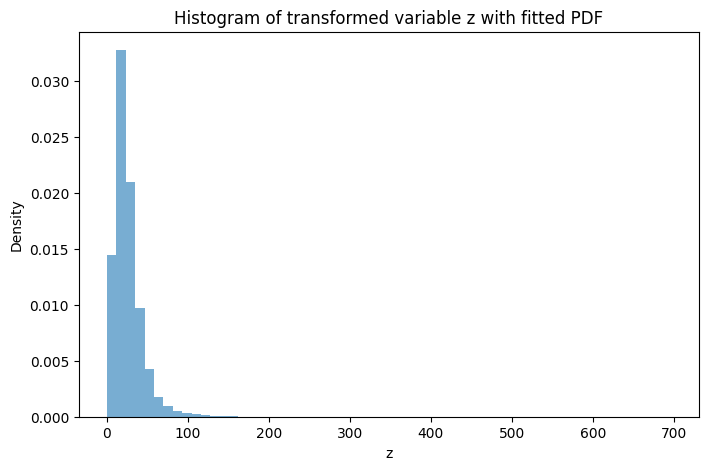
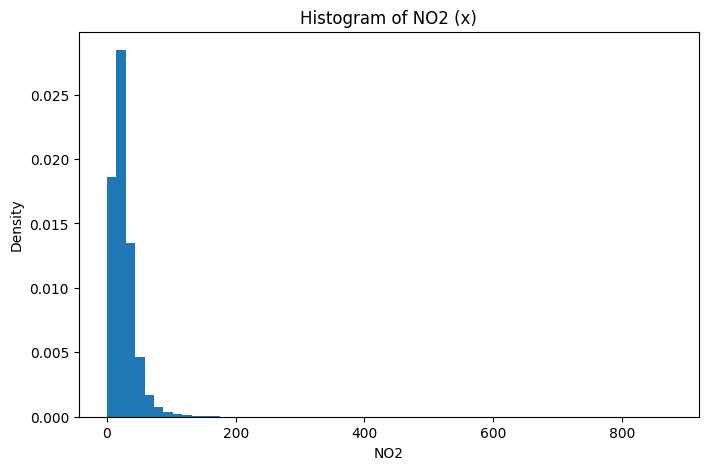

# Probability Density Estimation using Roll-Based Nonlinear Transformation

**Course:** UCS654 – Predictive Analytics using Statistics  
**Assignment:** Assignment 3 – Advanced Mathematics  
**Name:** Chirag Gupta  
**Roll Number:** 102303483  

---

## Project Description

This assignment explores probabilistic modeling of environmental pollution data using a nonlinear transformation that depends on the student’s roll number.  

The study uses **NO₂ (Nitrogen Dioxide)** concentration values from the India Air Quality dataset. After applying a customized nonlinear transformation, the parameters of a Gaussian-type probability density function are estimated from the transformed data.

---

## Objective

- Apply a roll-number-based nonlinear transformation  
- Estimate distribution parameters from transformed data  
- Fit a Gaussian-type probability density model  
- Compare empirical distribution with theoretical density  

The probability density function used is:

\[
\hat{p}(z) = c \, e^{-\lambda (z - \mu)^2}
\]

---

## Dataset

- **Dataset Name:** India Air Quality Data  
- **Feature Used:** NO₂ concentration  
- **Source:** https://www.kaggle.com/datasets/shrutibhargava94/india-air-quality-data  

---

## Methodology

## 1️⃣ Roll-Based Nonlinear Transformation

Each original NO₂ value \( x \) is transformed into \( z \) using:

$$
z = x + a_r \sin(b_r x)
$$

where

$$
a_r = 0.05 (r \bmod 7)
$$

$$
b_r = 0.3 (r \bmod 5 + 1)
$$

For roll number **102303483**:

| Parameter | Value |
|-----------|--------|
| \( a_r \) | 0.1 |
| \( b_r \) | 1.2 |

---

## 2️⃣ Parameter Estimation

After removing missing values and computing statistics from the transformed variable \( z \):

| Parameter | Estimated Value |
|-----------|-----------------|
| \( \mu \) | 25.811134492949602 |
| \( \lambda \) | 0.0014674149402736612 |
| \( c \) | 0.021612327098739347 |

Using:

$$
\lambda = \frac{1}{2\sigma^2}
$$

$$
c = \sqrt{\frac{\lambda}{\pi}}
$$

---

## Graphical Analysis

### Histogram of Original NO₂ Data

The raw NO₂ data exhibits a positively skewed distribution, with most observations concentrated at lower values and a noticeable right tail.

---

### Histogram of Transformed Data with Fitted PDF

After transformation, the distribution becomes smoother. The fitted Gaussian-type curve closely matches the central region of the empirical histogram, indicating effective parameter estimation.

---

## Final Estimated Density Function

p̂(z) = 0.021612327098739347 · e^(−0.0014674149402736612 (z − 25.811134492949602)²)

---

## Conclusion

The roll-number-dependent nonlinear transformation provides a structured way to modify real-world environmental data before probabilistic modeling.  

Using statistical estimation techniques, the parameters of a Gaussian-type distribution were successfully learned from the transformed NO₂ dataset.  

The graphical comparison between empirical data and the theoretical density function confirms that the model provides a reasonable approximation of the transformed distribution.
